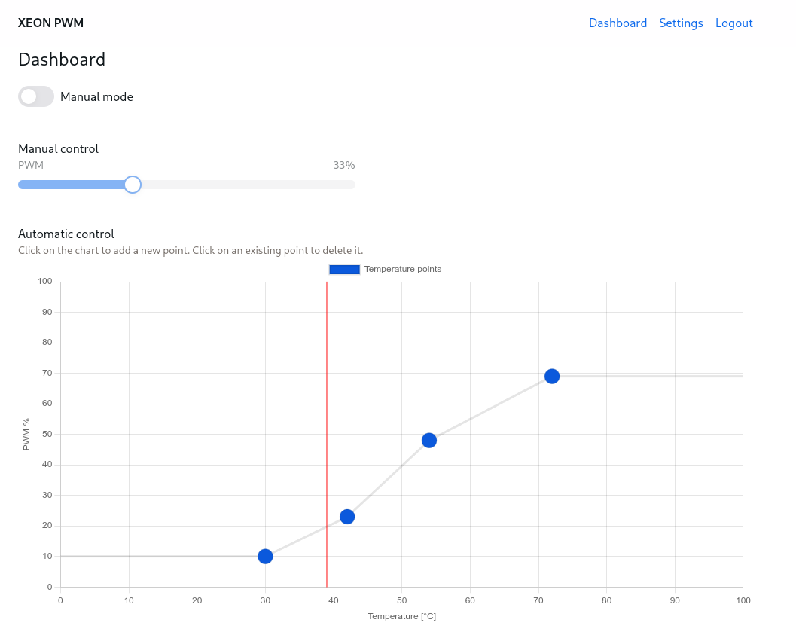
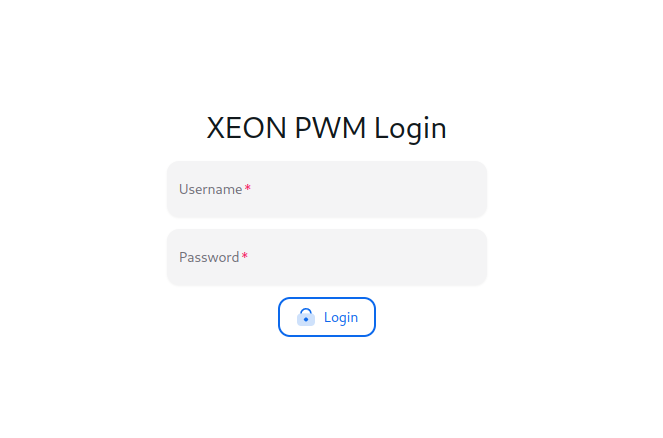

# XEON PWM Panel

XEON PWM is an application which I developed to control my server fans using my makeshift controller.

This is the backend part. It uses the 
[ASP.NET Core](https://learn.microsoft.com/en-us/aspnet/core/introduction-to-aspnet-core) framework.
Settings and users are stored in a Sqlite
database using the [EF Core](https://learn.microsoft.com/en-us/ef/core/) framework.
[SignalR](https://learn.microsoft.com/en-us/aspnet/core/signalr/introduction) (websocket) 
is used to update temperatures etc. 

I chose to implement [my own authentication scheme/handler](XeonPwm.Api/Auth/TokenAuthHandler.cs) 
because I did not want to use JWT for sessions and I did not like the built-in Identity system.

## Other repos
Links to related repos:
- React app: [xeonpwm-ui](https://github.com/bonk-dev/xeonpwm-ui)

## Features
- manual mode
- automatic control based on current temperature

## Run the app
Here is how you can run the app:
1. Clone the repo
2. Change the settings (appsettings.(Development.)json))
3. `cd XeonPwm.Api && dotnet run`

Keep in mind that the API needs a working Arduino controller.

## Screenshots

### Dashboard

### Login panel

